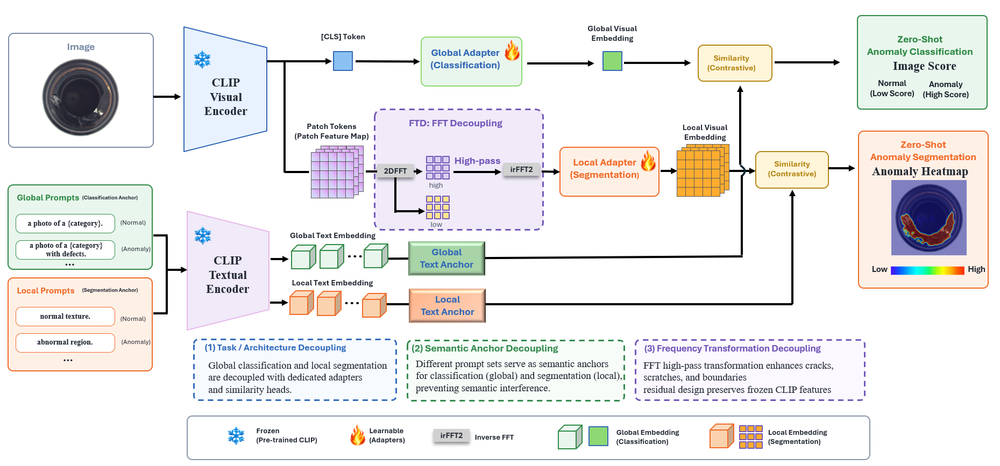

# DecoupleCLIP

Official implementation of **DecoupleCLIP**.


## Overview



## Installation

```bash
conda create -n decoupleclip python=3.9
conda activate decoupleclip
pip install -r requirements.txt
```

## Usage

Train DecoupleCLIP:

```bash
python DecoupleCLIP_train.py \
  --training_data mvtec \
  --testing_data visa \
  --model ViT-L-14-336 \
  --epoch 15 \
  --batch_size 2 \
  --image_size 518
```

Evaluate a checkpoint on a dataset:

```bash
python DecoupleCLIP_test.py \
  --ckt_path weights/best.pth \
  --testing_model dataset \
  --testing_data visa \
  --model ViT-L-14-336
```

Run inference on a single image:

```bash
python DecoupleCLIP_test.py \
  --ckt_path weights/best.pth \
  --testing_model image \
  --image_path asset/img.png \
  --class_name candle \
  --save_path workspaces
```

## Repository Structure

```text
DecoupleCLIP_train.py        Training entry point
DecoupleCLIP_test.py         Evaluation and single-image inference entry point
dataset/                     Dataset loaders
data_preprocess/             Dataset preprocessing scripts
method/                      DecoupleCLIP model and CLIP components
tools/                       Logging, metrics, visualization, and training utilities
fig/overview.png             Method overview
loss.py                      Training losses
requirements.txt             Python dependencies
```

## Acknowledgements

Our work is largely inspired by the following projects. Thanks for their admiring contribution.

- VAND-APRIL-GAN
- AnomalyCLIP
- AdaClip
